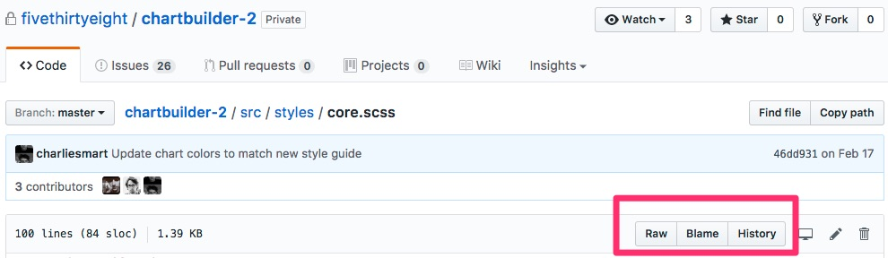

# Git & GitHub for Data Journalists

|    | Lesson             | Description
|----| -------------------| ----------------------------------
|  1 | [`intro.md`](intro.md)         | An Introduction to Git and GitHub
|  2 | [`git.md`](git.md)           | Using Git Locally
|  3 | [`github.md`](github.md)        | Using Git with GitHub
|  5 | [`datarepo.md`](datarepo.md) | FiveThirtyEight's data repo
|  6 | [`opensource.md`](opensource.md) | Using GitHub's Open Source and Social Features
|  7 | [`resources.md`](resources.md)     | Additional Resources

## Reference Sheets

Markdown Reference Guides (for writing READMEs)

* https://help.github.com/articles/basic-writing-and-formatting-syntax/
* https://beegit.com/markdown-cheat-sheet

GitHub Glossary (great reference guide for beginners)

* https://help.github.com/articles/github-glossary/

Git Glossary (more advanced, but comprehensive)

* https://git-scm.com/docs/gitglossary# Git and GitHub for Data Journalists

GitHub

* A place to store code
* A place to store data
* A place for [discussion](https://github.com/fivethirtyeight/data/issues?q=is%3Aissue+is%3Aclosed+sort%3Acomments-desc) about data and code
* A place for [open source](https://github.com/fivethirtyeight/data/pulls?q=is%3Apr+is%3Aclosed+sort%3Acomments-desc) [collaboration](https://github.com/tj/git-extras/pull/356) on projects
* A place for [collaboration](https://github.com/fivethirtyeight/world-cup/graphs/contributors) [within](https://github.com/fivethirtyeight/letsgo/pull/46) FiveThirtyEight
<!-- Walt or Neil or Ben for example will share some code with me and I can clean it up, or make it run every day. You should definately do all your coding on GitHub so that you can share and learn collaboratively. -->
* A place to find people working on the same things you are
* A place to find sources / people with expertise in a particular dataset
* A place to find other digital tools ([scrapers](https://github.com/search?q=basketball+reference&type=Repositories&utf8=%E2%9C%93), [file converters](https://github.com/search?utf8=%E2%9C%93&q=spss+por+to+csv&type=), etc)
<!-- Search "spss por to csv"-->
* A place to host static [websites](http://dhrumilmehta.com/) (GitHub Pages: [https://pages.github.com/](https://pages.github.com/))
<!-- Github Pages -->
* A place to find open source work and analysis
* A [portfolio](https://github.com/dmil) of your technical work (or technical learning)

Git versus GitHub: 

* Git is a distributed version control system. It is a technology.

* GitHub is a social coding platform where git repositories are stored and where people can collaborate on projects. GitHub is great both for collaboration within your organization, but also provides an excellent model for open source collaboration across organizations or with the public. We do both of these here at FiveThirtyEight.

On **GitHub** you can find **Git** repositories. 

Learn More: https://jahya.net/blog/git-vs-github/# Git

Wikipedia 
> Git (/ɡɪt/[8]) is a version control system (VCS) for tracking changes in computer files and coordinating work on those files among multiple people. It is primarily used for source code management in software development,[9] but it can be used to keep track of changes in any set of files. As a distributed revision control system it is aimed at speed,[10] data integrity,[11] and support for distributed, non-linear workflows.[12]

Github

> Git is an open source program for tracking changes in text files.
> https://help.github.com/articles/github-glossary/

## What is Git?

Keeping track of file versions is hard.


#### So what is Git, and why does it help us?
Above all else, Git is a fast and **distributed** version control system, that allows you to efficiently handle projects large and small.

Here are some problems we face, and how git solves them:

#### Reverting to past versions

Git allows us to make save points at any time. These save points are called '**commits**'. Once a save point is made, it's permanent, and allows us to go back to that save point at any time. From there, we can see what the code looked like at that point, or even start building off that version.

#### Keeping track of what each version 'meant'

Every commit has a description (**commit message**), which allows us to describe what changes were made between the current and previous commit. This is usually a description of what features were added or what bugs were fixed.

Additionally, git supports tagging, which allows us to mark a specific commit as a specific version of our code (e.g. '2.4.5').

#### Comparing changes to past versions

It's often important to see content of the actual changes that were made. This can be useful when:

* tracking down when and how a bug was introduced
* understanding the changes a team member made so you can stay up-to-date with progress
* reviewing code as a team for correctness or quality/style

Git allows us to easily see these changes (called a **diff**) for any given commit.

#### Fearlessness in making changes

In writing code (or copy), we often want to experiment in adding a feature or refactoring (rewriting) existing code. 

Because git makes it easy to go back to a known good state, we can experiment without worrying that we'll be unable to undo the experimental work.

Note: This section was borrowed from [Al Johri's guide to Git & GitHub](https://github.com/AlJohri/DAT-DC-12/blob/master/notebooks/intro-git.ipynb)

## Some Vocabulary

* **Git** - version control software
* **Repository** - a folder containing your files and also containing a structure that helps keep track of changes in those files. When you intialize a repository, git creates a hidden folder (`.git` folder) that stores the changes to those files.
* **GitHub** - a place to host git repositories and collaborate
* **Local Repository** - the version of a git repository on your local computer
* **Remote Repository** - the version of a git repository stored somewhere else that your local repository is connected to (frequently on GitHub)
* **Commit** - the basic unit of a git repository is a commit. It is a set of changes to a file. A commit usually comes with an id as well as a **commit message** that describes the change.

Within a Repository you have

* **Untracked Changes** - files that are in your folder but that git doesn't pay attention to.
* **Staging Area** - a place where you can put files before you commit them. Once files are in the staging area, git is paying attention to them.
* **Commit Log** (aka Git History) - all of the commits (previous changes) to all of the files in your repository.

## Lets use Git!

Note that everything we are about to do is happening locally on your computer. We have not yet involved GitHub.

### Step 1: Create a new local repository on the Desktop


Note: This creates a new folder on your desktop which  contains a single file with the name `README.md`

### Step 2: Create some commits

1. Add the following to the file called `README.md`:	
	
	```
	# My Simple Website
	
	This repository contains code for my simple website.
	I am building this Simple Website as a way to learn about **Git** and **GitHub**.
	```
	and commit it with the commit message "add documentation in the README file"
	
	

2. create a new file called `index.html`
	
	```
	<!DOCTYPE html>
	<html>
	<head>
  		<link rel="stylesheet" href="styles.css">
	</head>
	<body>
		<h1> My Simple Website </h1>
		<p> I'm building this website in the process of learning about github. </p>
		<script src="main.js"></script>
	</body>
	</html>
	```
	and commit it with the commit message "add website homepage"
	
3. create a new file called `styles.css`

	```
	body {
		background: teal;
	}
	```
	and commit it with the commit message "make homepage teal"
	
### Step 3: Lets pause and view the history


Right now the commit history is linear, as visualized in the network diagram below. Later when we learn about branching this won't be the case. Keep this in mind as we move forward to the next section.


## One More Thing: Branching!

Until now our commit history has been linear. However, sometimes in projects we want to try something new without losing the stable state which our project is in. At times like these, branching is most useful. Branching is another tool that really helps you to be fearless with your changes. It creates a new paralell version of your project where you can make changes and not worry about breaking the project. Once you're confident of those changes, and have decided you'd like to add them to your main project, you can merge the paralell branch back into the master branch of your project.

Remember, we're doing this with a website right now, but you can also follow the same workflow with your data, your analysis, your code, your images, or even your copy!


### Step 4: Create a new branch called "personalize"


Now your branches tab should look like this. Note that there is a checkmark next to the "personalize" branch. That means you're now working on the "personalize" branch.


### Step 5: Make some changes to personalize the webpage in the `personalize ` branch

**Note:** as you follow the instructions in this step, make sure you're commiting your changes to the `personalize` branch. The commit button will indicate which branch you're commiting to (as shown below).


1. Change the background color to your favorite color and commit this change to the `personalize` branch. Don't forget to write a descriptive commit message describing the change.
2. Change the name of website from "Simple Website" to something like "Dhrumil's Simple Website" and commit this change to the `personalize` branch. 
3. Add an image of your choice by dropping this code into the "body" of the webpage

	```
	
	```
	
	and commit this change to the `personalize` branch with a descriptive commit message. 

### Step 6: Lets Pause and Think about Branches

Now you have two parallel branches. `master` and `personalize`. The `master` branch contains the code for your simple website, and the `personalize` branch contains the feature where you personalize it. You have now started a non-linear workflow, and that is the beauty of git!


You can also have multiple branches working at once. For example, here is the network diagram of an active project (chartbuilder)

https://github.com/fivethirtyeight/chartbuilder-2/network

Particularly when the workflow is collaborative, different people may be working on different branches. This is why its important to always merge master into your branch before beginning the day's work. That way you can get the latest updates from the main stable branch and make sure the latest changes in the `master` branch of the project don't conflict with any work you're trying to do.

Right now we won't worry about it too much, but basically if you're working in a branch other than `master` you probably want to be hitting the "update from default branch" button shown below pretty often.


### Step 7: Merge the `personalize` branch back into `master`

Make sure everyting is commited into  the personalize branch and the staging area is empty. This means it should say `0 changed files` as shown below. All of your commits should be in your commit history.


Then switch the branch to `master` and merge the `personalize` branch into the `master` branch.


## Recap: The Branching Workflow

1. Create a new branch
2. Switch to the new branch
3. Regularly commit changes to the new branch
4. Regularly update from `master` branch as you work
5. When you're done, switch to `master`
6. Merge the new branch into master
7. Delete the new branch


## Things we did not go over

* Merge Conflicts - if two branches you are trying to merge contain changes made to the same line of code, you will have what is called a "merge conflict". In a case like this, git will show you both changes in a file, and you will have to resolve the conflict by deciding what that file should look like before you complete the merge.
* `.gitignore` - a hidden file that contains a list of files which your git repository will ignore. For example, we keep all of our passwords in a separate file and add it to the gitignore so that they don't get accidentally added to the repository.
* `.git` folder. A Hidden folder that stores all the files that manage this git repository. It contains the git history, each commit, and all the other metadata associated with this git repository.
	
## Good rules of thumb

**DO:**

1. Commits are cheap, make them all the time!
2. Pull from GitHub regularly
3. Push to GitHub regularly
4. Create a branch for each "feature" or new discrete chunk of work that you're going to do. 
5. Keep the `master` branch clean - Don't a branch into master until you are confident that it is in its final form.
6. If you're concerned about messing up the history of a branch, create a new branch and work in there. 
7. Don't Worry! Everything is reversible. The whole point of Git is that you can go back to any point in time. You can go back to any commit on any branch at any time.

**DON'T**

1. Commit passwords to your git repository (keep those uncommited)
2. Rewrite git history

## Pushing to GitHub

### Step 8: Push the `master` branch to github


Lets view the repository on github now and explore how GitHub displays everything we have done.


One thing to take note of is that we only pushed the `master` branch to GitHub so it doesn't know about the `personalize` branch at all. Right now, the `personalize` branch exists locally on our computer, but it doesn't exist in GitHub.

## Diagram

Here is a diagram I once drew. You can ignore the text written in pen (those are terminal commands)


### Step 9: Delete the `personalize` Branch locally

Finally lets delete the `personalize` branch on our local computer.


### Step 10: Rejoice, then move onto the [next section about GitHub](github.md).   # GitHub

Now that we've pushed our code to GitHub, lets explore the features that it adds.

1. Collaboration. This is HUGE! Github has a lot of great features to help you collaborate with your team.
2. Open Source. This is ALSO HUGE! Strangers can see your code and participate with you on your project. They can suggest fixes, point out errors, and start discussions. You can find other people's work, and make sure you're not duplicating something that already exists. Or you can interact with someone who has already worked on something similar to what you're trying to tackle.
3. Web Hosting! The GithubPages feature allows you to host a static website for free, right on GitHub.
4. A better visual interface. In the last lesson you learned how to merge branches locally. In this lesson we'll learn how to do the same on GitHub. Many of the functions you can perform locally are nicer to perform on GitHub's great web interface.

## Lets Dive In!

Remember, there are now two copies of your repository, your **local repository** which sits on your computer, and your **remote repository** which is on GitHub. Lets take a look a the remote repository that is on GitHub.

* https://github.com/dmil/my-simple-website

## (Some of) GitHub's Features

### The `README.md` file

Github looks for a "readme" file and renders it as you're navigating through the file structure. This is a great way to guide people through your code.


Its particularly evident on our data repository, where the overall repository has a readme, but each folder also contains its own readme.

* https://github.com/fivethirtyeight/data

Readme files are often given the `.md` extension, meaning they're written in a language called markdown that allows for nicer formatting. You can check out this [markdown cheet sheet](https://beegit.com/markdown-cheat-sheet) if you want to see how formatting works, but you can also save a readme files as plain text. Github will also detect `.txt` files, or you can just write plain text inside your `.md` file.

## Commit log

Commit Log

* https://github.com/dmil/my-simple-website/commits/master

## History, Raw, and Blame for any file

* File
	* https://github.com/fivethirtyeight/chartbuilder-2/blob/master/src/styles/core.scss
	* 
* History
	* https://github.com/fivethirtyeight/chartbuilder-2/commits/master/src/styles/core.scss
* Blame
	* https://github.com/fivethirtyeight/chartbuilder-2/blame/master/src/styles/core.scss

## Editing files inside GitHub


## Drag and Drop


## Collaboration

Add `dmil` (that's me!) as a collaborator. Now I can push to your repository. Collaborators can push to the repository without asking your permission, they have full read and write access.


If I wasn't a collaborator, I could still work with you on an open source project through a process called forking where I can make a copy of your repository in my GitHub account, make changes, and request that you merge them back into your project. We will discuss forking more in depth later.

## Serving up Websites!

GitHub is also great for serving up static websites. Right now, you have the code for your website on GitHub, but its not being served up anywhere. GitHub is only storing the code. Luckily, if your code happens to be a website, GitHub can also host it for you through a feature called "GitHub Pages". 

Simply go to the "settings" menu, scroll down to "GitHub Pages", and select "master branch"


Whatever is in your master branch on GitHub should now appear at 

```
http://your-username.github.io/repository-name
```

in my case it is [**http://dmil.github.io/my-simple-website**](http://dmil.github.io/my-simple-website)

## Pull Requests

In the previous tutorial we merged branches locally on our computer. This is, however, not ideal when working on projects with other people. The best practice is to issue pull requests on GitHub. 

A **pull request** is a request to merge one branch into another branch. Right now our repository only has one branch, so we cannot issue a pull request.

* https://github.com/dmil/my-simple-website/branches

Lets demonstrate how branches are merged by creating a new branch

### Step 1: Create a new branch LOCALLY called `poke-fox`

1. Pick an image of a fox from the internet and replace the image on your site with this new fox image. I'm going with this one, the URL is below.

	[https://s0.wp.com/wp-content/themes/vip/espn-fivethirtyeight/assets/images/logo-fox-head-color.svg](https://s0.wp.com/wp-content/themes/vip/espn-fivethirtyeight/assets/images/logo-fox-head-color.svg)
	
	

	Commit this change with a descriptive commit message like "change image to fox"

2. Add this code in a file called `main.js`

	```
	//define a function
	function sayDontPoke() {
		alert('dont poke the fox');
	}
	
	// refer to a function
	document.querySelector('img').onclick = sayDontPoke
	
	// call a function
	sayDontPoke()
	```
	
	Commit this change with a descriptive commit message like "alert message when fox image is clicked"
	
### Step 2: Push this new branch to GitHub (don't merge it locally!)


	
Now when you naviate to your GitHub repo, you should see both branches


### Step 3: Issue a pull-request from the `poke-fox` branch to the `master` branch

Navigate to the repository on GitHub, then click on the navigation bar where it says "2 branches" as shown below.


That should bring you to this screen where you can view all of your branches and issue a pull request back.


Then you will arrive at this screen


1. Add a descriptive message
3. look at all the commits that are different on this branch from `master`
3. review which files where changed
4. "Create pull request"

### Step 4: Merge this pull request into your master branch

Normally, when working collaboratively, this is the phase where discussions begin. Other collaborators will review what you intend to merge in, and then when you have agreed to add this new code/text/data/etc to the `master` branch, someone on the team can hit "Merge pull request".


Once you're done with that, you can delete the branch! 


### Step 5: Fetch the remote changes (changes that happened in GitHub) onto your local computer.

The merging of `poke-fox` into `master` happened on GitHub, however, your local machine still doesn't know about these changes. Also, if you were working on a project with someone else, your local computer would also not know about the changes your collaborators have made to the project either. Therefore, we have to go back to our local computer and fetch the new changes on each branch.


You'll notice when you do this for the `poke-fox` branch (as shown in the image below), the fetch button changes to "Publish this branch to GitHub".

### Step 6: Delete local branches you aren't using

Since we have deleted the branch `poke-fox` branch on github, it now exists on our local computer, but doesn't exist on github. I like to clean up my local computer whenever I can to remove branches I'm no longer using. You can delete the `poke-fox` branch as shown in the image below.


## Recap: The GitHub Collaborative Workflow

[images/Presentation2.pptx](images/Presentation2.pptx)

1. Open your local GitHub for Mac app to the repository you're working in
2. Pull the latest `master` from GitHub
3. Switch to the `feature-branch` you intend to work on
4. Pull the latest of `feature-branch` from GitHub
5. **work then commit, work then commit, work then commit ...**
6. Push the `feature-branch` to GitHub
7. Issue a Pull Request on GitHub from the `feature-branch` to `master`
8. Merge the Pull Request into `master` on GitHub
9. Delete the **remote**`feature-branch` on GitHub
10. Pull `master` **locally** back to your computer
11. Delete `feature-branch` locally


## Alternate workflow (for yourself)

1. Do whatever you want locally and don't make changes directly on GitHub
2. Keep pushing all branches to GitHub at regular intervals
## Our Data Repo Setup

The private and public data repos are now both forks of the same repository. Below are instructions on setup and adding new data.

This means I have on my computer one repository locally. However it has two **remote repositories** on GitHub, one private and one public. Each remote repository has its own branches.


## Process for Publishing Data

1. Writers submit data via email
2. Create a `new-dataset` branch on the `private-data` remote repository and send that in the email where data is filed.
3. Discuss the data and README in the email thread with the author of the peice and the editors, make edits as needed inside the `new-dataset` branch.Then issue a pull request back to the `master` branch of `private-data`.
4. Review and merge pull request back into the `master` branch of `private-data` and delete the branch.
5. Review the [private repo](https://github.com/fivethirtyeight/private-data). If everything looks correct, pull the master branch of the `fivethirtyeight/private-data` **remote repository** to my local computer and then push it up to the [public](https://github.com/fivethirtyeight/data) `fivethirtyeight/data`.
		
**Note:** In this setup, the `private-data` repo will have many branches, however we only ever push the `master` branch to the public `data` repository.

Additionally, the private repo is always ahead of the public repo. Never add directly to the public repo (or if you do make sure to push that change back to the private repo).

# Open Source (and forking)

## Branching vs Forking

* **Branching** is a feature of Git, you've used branching already
* **Forking** is a feature of GitHub
	* 	A fork is a personal copy of another user's repository that lives on your account. Forks allow you to freely make changes to a project without affecting the original. Forks remain attached to the original, allowing you to submit a pull request to the original's author to update with your changes. You can also keep your fork up to date by pulling in updates from the original. - [GitHub Glossary](https://help.github.com/articles/github-glossary/)
	*  When you fork a repository, you get all of the branches the other person posted on GitHub
	*  Pull requests however, don't acknowledge forks since they are a feature of GitHub and not Git

### Step 1: Fork a copy of my `mozilla-website` repository into your own account!

This

https://github.com/`dmil`/mozilla-website

will fork to 

https://github.com/`your-username`/mozilla-website


If you want to see the site rendered in your GitHub pages, go to Settings > GitHub Pages and select the "master" branch to render the page from.

### Step 2: Make ONE change!

**Make Changes on GitHub**

The short way to do this is to just make the changes directly in the GitHub web editor in the `your-username/mozilla-website` repository's `master` branch. 

**Optional (make changes locally instead)**

If you want to get some more practice with GitHub though, you can clone the repository locally onto your Desktop. Make the changes, commit them, and then push the new commits from your **local** `master` branch to your **remote** `master` branch in GitHub.


### Step 3: Issue a pull request back to my repository

Issue a pull request back from the `master` branch of the `your-username/mozilla-website` to the `master` branch of `dmil/mozilla-website`


### Step 4: Wait for me to approve the pull request and see the change on my site.

compare

http://dmil.github.io/mozilla-website

with

http://`your-username`.github.io/mozilla-website

### Step 5: Woohoo! You just collaborated open-source.

Open source collaboration is great for:

* Not duplicating work
* Collaborating accross organizations
* Interacting with people - sometimes making an issue or a pull request can lead to friendship (or sources or collaborators)
* Reader feedback
* [Collective debugging](https://github.com/themarshallproject/klaxon/issues/107), finding critical [errors](https://github.com/fivethirtyeight/data/pull/54) faster (often also leads to better security and better data quality).
* [Building upon](https://twitter.com/ascheink/status/783394500710457344) someone else's project
* [Feuding](https://github.com/jashkenas/underscore/issues/2182)
* [Philosophical](https://www.gnu.org/philosophy/shouldbefree.en.html) [Reasons](https://www.gnu.org/philosophy/open-source-misses-the-point.en.html)
* Being [nerdy](https://github.com/fivethirtyeight/data/pull/63)?
# Additional Resources

## Git, for things other than code
* Auditing system for changes on a file
* For collaboratively editing a text document
* [For drafting government web design standards!](https://github.com/18F/web-design-standards)
* Open [comment period](https://github.com/whitehouse/source-code-policy/issues?q=is%3Aissue+is%3Aclosed) for policy
* [Drafting](https://github.com/twitter/innovators-patent-agreement) and [collaborating on](https://github.com/twitter/innovators-patent-agreement/issues) legal documents
* Open journalsim showcase
	* 	https://github.com/showcases/open-journalism
* Github for Government
	* https://government.github.com/
	* https://government.github.com/community/

## Further Reading

* Understanding Git Conceptually
	* ​https://www.sbf5.com/~cduan/technical/git/
* Reference Guides to Git Commands
	* https://git-scm.com/docs
* Git Screwup Guide
	* http://ohshitgit.com/
* Git/Github Cheat Sheets
	* https://training.github.com/kit/downloads/github-git-cheat-sheet.pdf
	* http://ndpsoftware.com/git-cheatsheet.html
* Licensing Open Source Code
	* ​http://choosealicense.com/
	* https://help.github.com/articles/open-source-licensing/

	
## Learn to use Git from the Command Line
* Interactive Tutorial
	* ​https://try.github.io
* Basic Git Commands
	* ​http://www.teaching-materials.org/git/slides.html
	* http://rogerdudler.github.io/git-guide/

## Tools from my previous trainings/classes
* http://slides.com/dhrumilmehta/how-to-tell-a-story-with-data-tools-of-the-trade-2#/4/21
* https://github.com/dmil/hks-coursework/blob/master/gitreference.md
* Dhrumil in video form
	- https://www.youtube.com/watch?v=O4Zc8DJ9MdQ
